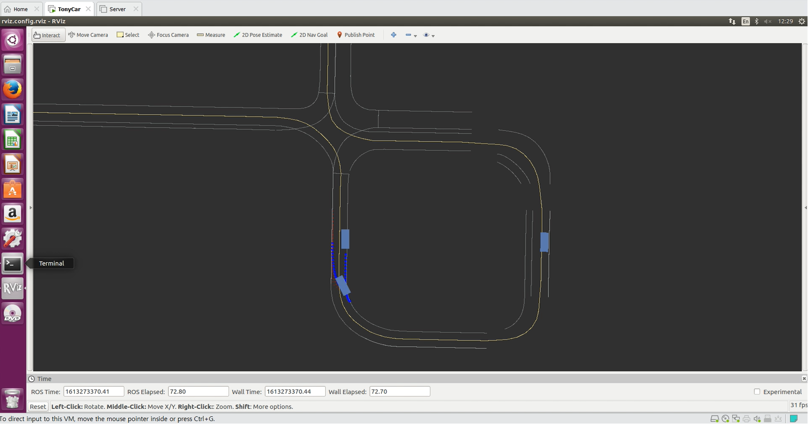

# do not collide 

1. 속도는 PID 중 P gain만 속도 에러에 적용시켜서 가속도를 조절하였습니다. 
2. optimal_frenet 을 통하여 최적의 경로를 구하고 그 경로를
3. stanley 방법을 통하여 tracking 하게 만들었습니다.

Marker를 통해서 현재가고있는 경로와 가능한 경로를 보이게 만들었습니다.
3.py 가 최종본이고 나머지는 연습본입니다.

건드린것
1. obastacle이 cartesian 좌표이기에 frenet 으로 옮겨서 적용하였습니다.

2. 속도가 상당히 느린것같아서 target_speed를 조금 높게 하였습니다.

3. check_path() 에서 각각 속도, 가속도, 곡률 ,충돌 에대하여 print문을 달아서 발생할때마다 MAX를 늘려주다가 그냥 많이 늘려줬습니다.

4. collision_check 할떄 Path를 미리 변경하지 않으면 no_solution 이 발생하여 구해진 path들 의 경로를 조금 늘려주어서
미리 바꿀수 있게 하였습니다. 너무 늘린 경우에는 계산량이 많아져서 컴퓨터가 감당할 수 없던것 같습니다.

5. 또한 LANE_WIDTH를 좀 더 넓혀서 유연하게 많은 경로를 계산하게하여 path의 길이가 조금만 길어져도 충분히 꺾어서 장애물을 피해가게 하였습니다.
넓히지 않은경우 no_solution 이 많이 발생하였습니다.

6. 아래에 주석처리된 markerArray = MarkerArray()로 경로들을 표현을 할 수 있지만 변성목님이 함수로 깔끔하게 정리했길레 그것으로 대체하였습니다.

